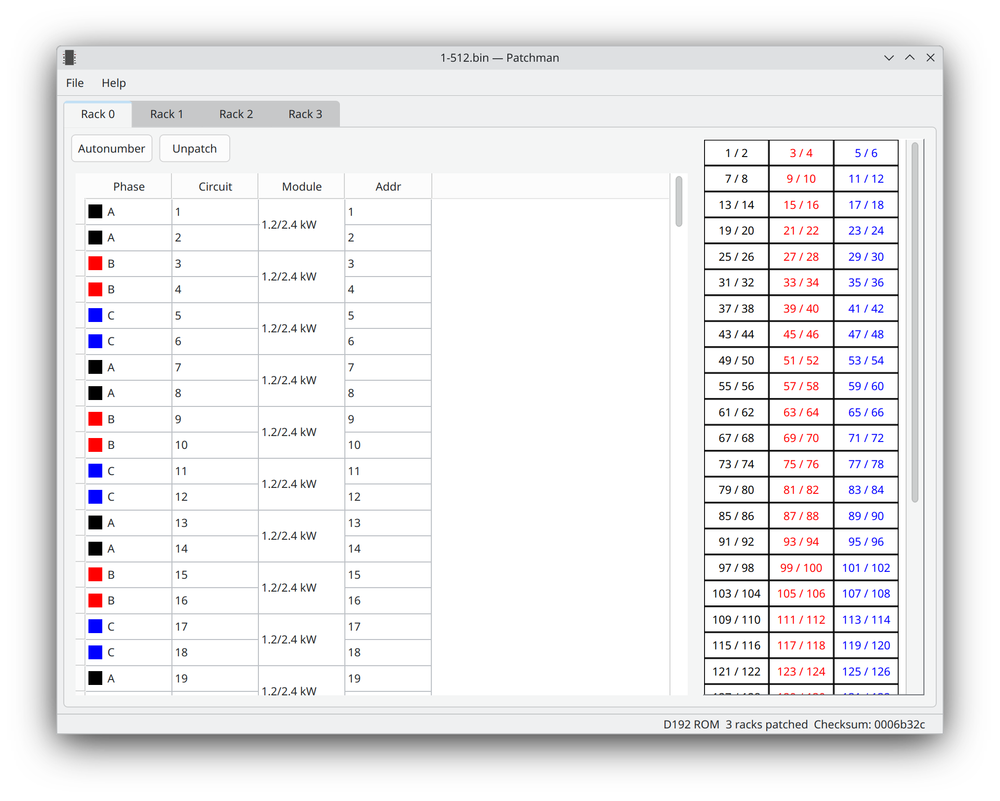

Patchman
========

Patchman is a browser and editor for patch ROM files for classic dimming systems.

Supported systems:
- Colortran Dimension 192
- Colortran ENR

To support other systems, documentation must exist for the binary layout, or
several ROMs for known systems must exist for reverse engineering.

ROM files may be in raw binary or Intel HEX format.

Download
--------
See releases [here](https://github.com/danielskeenan/patchman/releases).

Documentation
-------------
See current documentation [here](https://danielskeenan.github.io/patchman/).
