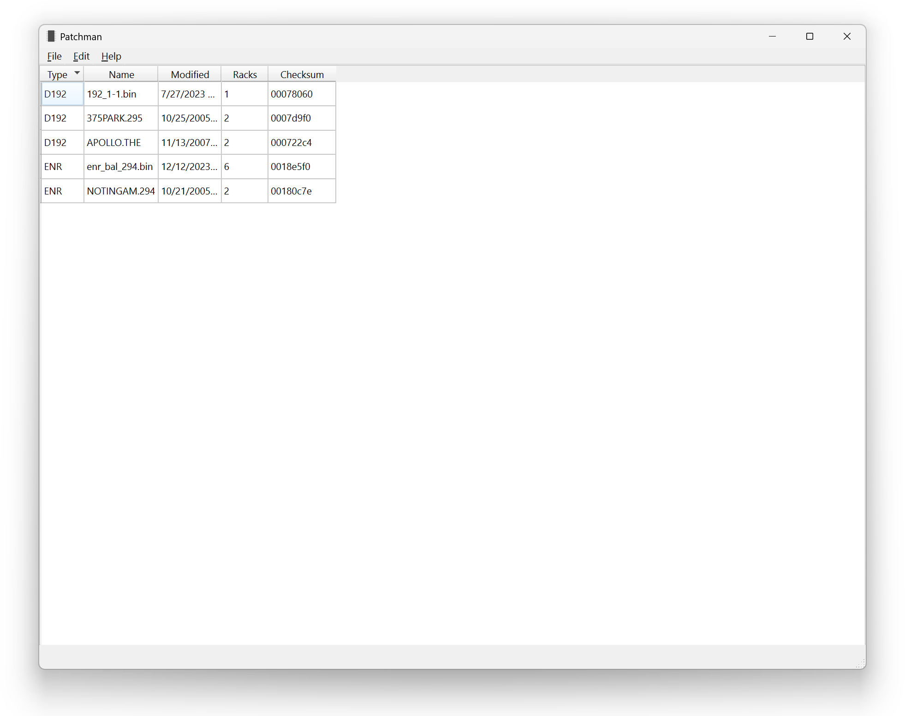
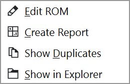

.. index:: Browser

Browser
=======

The Browser is the first window shown when opening Patchman.

Upon launch, the browser will scan all folders set in the settings (see
:doc:`first_time` for how to change these folders); progress is illustrated at
the bottom of the window.

.. index:: Checksum

A table lists the type, name, date, rack count, and checksum for each ROM found.
Click on a column header to sort the table by that column.

.. note:: If files are missing, ensure the path they are in is set as a search
   path in the settings and that it is a
   :ref:`supported file type <supported-systems>`.

To edit a file, double-click on its entry.

.. |icon-duplicate| image:: img/icons/document-duplicate.png
   :height: 24px

If the same patch table appears in multiple files, each file will be marked with
a |icon-duplicate| icon.

Further options are available by right-clicking on its entry:

:guilabel:`Edit ROM`
   Open the :doc:`editor`. Same action as double-clicking on the row.

.. index:: Reports

:guilabel:`Create Report`
   Create a document visually demonstrating, for each rack in the ROM, the
   location of each DMX address. See :doc:`reports`.

.. index:: Duplicates

:guilabel:`Show Duplicates`
   Show all ROM files that contain the same patch information as the selected
   ROM file.

:guilabel:`Show in Explorer`
   Open the file browser and highlight the file.
