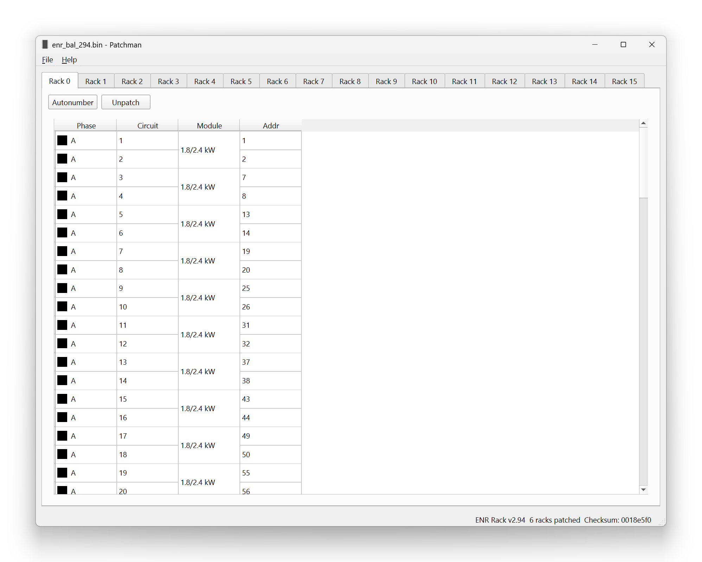
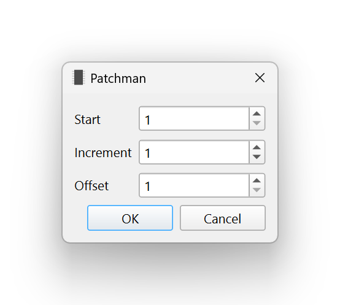

.. index:: Editor
Editor
======

The Editor window displays the contents of a patch ROM and allows for changing
the addressing of individual circuits.

.. index:: Checksum
Each rack available in the ROM is shown as a tab across the top. Each circuit's
phase, circuit number, module type, and DMX address is shown in the table. Only
the address is editable. The status bar at the bottom of the window shows the
ROM type, number of racks with patch information, and ROM checksum.

.. note:: The module type is not stored in the patch ROM file. Instead, it is
   guessed based on contextual information from the circuit addressing.

The :guilabel:`Autonumber` and :guilabel:`Unpatch` buttons at the top will bulk-
edit the selected rows, or all rows if none are selected.

.. index:: Unpatch
To unpatch a circuit, set its address to ``0`` or press the :guilabel:`Unpatch`
button.

.. index:: Autonumber
Autonumber
----------
The Autonumber dialog makes addressing racks fast.

Start
   The first row selected (or the first circuit in the rack, if no rows are
   selected) will have this address.

Increment
   Add this amount to the address for each row when addressing. For example,
   with a Start of ``97`` and an Increment of ``2``, circuits are addressed as
   97, 99, 101, 103...

Offset
   Skip this many circuits in the selection when addressing. This is useful for
   single and half-density modules. For example, to populate the selected rows
   with 6kW modules that use only the first of the two circuits in the slot,
   select the desired rows to patch and set the Offset to ``2``.
