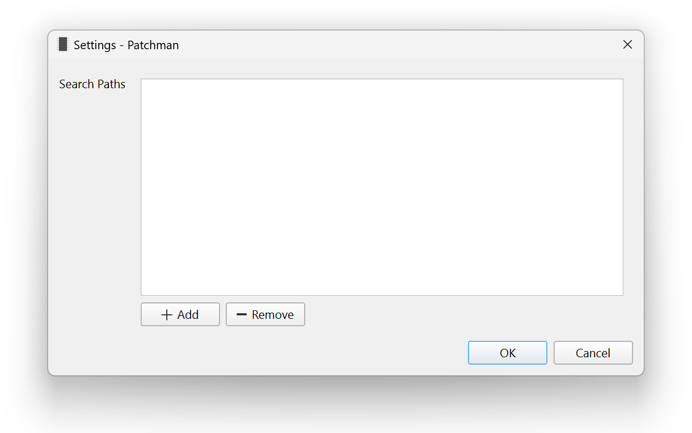

First-Time Setup
================

.. index:: Paths

The first time you open Patchman, you must set where your patch ROM files live.

Click :guilabel:`Add` to add a folder. If you have ROMs that live in more than
one folder, add each one individually.

.. note:: For best performance, add folders that only contain supported ROM
   files. Patchman must index the entire contents of these folders, and
   searching non-ROM files will slow the program down.

Once the search paths are set, click :guilabel:`OK`. The :doc:`browser` will
open and scan your ROM files.
